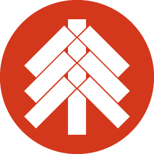

<div align="center">



# Kagura

A front-end framework that runs on WebAssembly written in Rust.

</div>

## Hello World

```rust
extern crate kagura;
extern crate wasm_bindgen;

use kagura::prelude::*;
use wasm_bindgen::prelude::*;

#[wasm_bindgen(start)]
pub fn main() {
    let node = web_sys::window()
        .unwrap()
        .document()
        .unwrap()
        .get_element_by_id("app")
        .unwrap();
    Kagura::mount(node.into(), || {
        vec![Html::h1(
            Attributes::new(),
            Events::new(),
            vec![Html::text("Hello Kagura")],
        )]
    });
}
```

## Usage

### Tutorial

[tutorial for v0.13](./docs/^0.13/index.md)

### Create a project

See `/project-template/^0.13` in this repogitory. This is a template of project of Kagura. You can custamize to use.

[project template for ^0.13](./project-template/^0.13/)

### Mount to web_sys::Node

```rust
Kagura::mount(web_sys::Node, impl FnMut() -> Vec<Html<Terminator>>)
```

`Terminator` is a component, which is a marker of root of dom. And, Kagura only changes children of mounted web_sys::Node.

### Create a component

<div align="center">
my_component.rs
</div>

```rust
use kagura::html::component::Cmd;
use kagura::prelude::*;

// Property of component
pub struct Props {}

// Message from Kagura to component
pub enum Msg {
    Clicked,
}

// Message from component to parent component
// You can send message from child component to parent component by this.
pub enum On {}

// Type of component
// Also, this is component state too.
pub struct MyComponent {
    greeting: String,
}

// Settig Props, Msg and On to MyComponent.
// (Sub means subscription.)
impl Component for MyComponent {
    type Props = Props;
    type Msg = Msg;
    type Sub = On;
}

impl Constructor for MyComponent {
    // Constructor of MyComponent.
    fn constructor(_props: &Self::Props) -> Self {
        Self {
            greeting: String::from("Hello world"),
        }
    }
}

impl Update for MyComponent {
    // The way to update MyComponent when MyComponent receive message.
    // MyComponent can send some messgae to Kagura by Cmd<Self>.
    fn update(&mut self, _props: &Props, msg: Msg) -> Cmd<Self> {
        match msg {
            Msg::Clicked => {
                self.greeting = String::from("Hello from Kagura");
                Cmd::none()
            }
        }
    }
}

impl Render for MyComponent {
    // The way to render MyComponent to Html<Self> when MyComponent was updated.
    // If you want to return list of Html<Self>,
    // you can use Html::fragment(Vec<Html<Self>>).
    fn render(&self, _props: &Props, _children: Vec<Html<Self>>) -> Html<Self> {
        Html::div(
            Attributes::new(),
            Events::new(),
            vec![
                Html::h1(
                    Attributes::new(),
                    Events::new(),
                    vec![Html::text(&self.greeting)],
                ),
                Html::button(
                    Attributes::new(),
                    Events::new().on_click(
                        // Event handler returns a message to update.
                        |_| Msg::Clicked,
                    ),
                    vec![Html::text("change greeting")],
                ),
            ],
        )
    }
}
```

### Mount a component

There are default-implemented function in Constructor trait.

`Self` means the component which mounts to. `DemirootComp` means the component which is mounted to.

```rust
fn with_children<DemirootComp: Component>(
    props: Self::Props,
    sub: Sub<Self::Sub, DemirootComp::Msg>,
    children: Vec<Html<DemirootComp>>,
) -> Html<DemirootComp>;

fn with_child<DemirootComp: Component>(
    props: Self::Props,
    sub: Sub<Self::Sub, DemirootComp::Msg>,
    child: Html<DemirootComp>,
) -> Html<DemirootComp>;

fn empty<DemirootComp: Component>(
    props: Self::Props,
    sub: Sub<Self::Sub, DemirootComp::Msg>,
) -> Html<DemirootComp>;
```

This is a example:

<div align="center">
lib.rs
</div>

```rust
extern crate js_sys;
extern crate kagura;
extern crate wasm_bindgen;
extern crate web_sys;

use kagura::prelude::*;
use wasm_bindgen::prelude::*;

mod my_component;

use my_component::MyComponent;

#[wasm_bindgen(start)]
pub fn main() {
    Kagura::mount(entry_point(), || {
        vec![MyComponent::empty(
            my_component::Props {},
            component::Sub::none(),
        )]
    });
}

fn entry_point() -> web_sys::Node {
    web_sys::window()
        .unwrap()
        .document()
        .unwrap()
        .get_element_by_id("app")
        .unwrap()
        .into()
}

```

This exmaple is mounting MyComponent to Terminator. And, in customed component, like MyComponent, you can do too in render. like this:

```rust
impl Render for MyComponent {
    fn render(&self, _props: &Props, _children: Vec<Html<Self>>) -> Html<Self> {
        CustomedComponent::empty(
            customed_component::Props {},
            component::Sub::none(),
        )
    }
}
```
