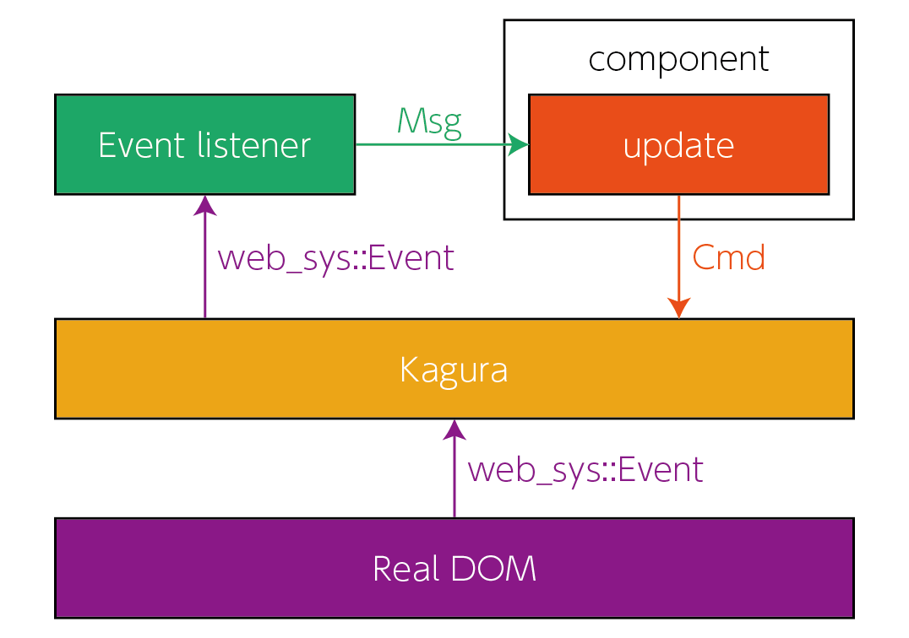

# Event handling

You can set event listeners to Element or TextNode. An event lisntener need an argument which type is web_sys::Event and an return value which type is your component's Msg.

<div align="center">format of an event listener</div>

```rust
|e: web_sys::Event| {
    // some process to make a Component's Msg.
    // some process to make a Component's Msg.
    // some process to make a Component's Msg.

    Msg::AComponentMsg
}
```

If a event listener is fired, the event listener send a message to its component. And then, the component call update function by the message. So, you can update status of the component.

<div align="center">



</div>

You can register event listeners to Kagura by `Events::on`. To create `Events`, there is a function `Events::new()`.

```rust
fn on(
    self,
    type_: impl Into<String>,
    handler: impl FnOnce(Event) -> Msg + 'static
) -> Self
```

`type_` is an event type, for example, "click", "mousedown", "keypress", "drag", and so on. `handler` is event listener, which maps web_sys::Event to Msg.

## Example

First, when you create a event listenner, it is needed to create a component which receives messages from the event listener.

<div align="center">src/example_component.rs</div>

```rust
use kagura::html::component::Cmd;
use kagura::prelude::*;

pub struct Props {}

pub enum Msg {
    Countup,
}

pub enum On {}

pub struct ExampleComponent {
    btn_count: usize,
}

impl Component for ExampleComponent {
    type Props = Props;
    type Msg = Msg;
    type Sub = On;
}

impl Constructor for ExampleComponent {
    fn constructor(_props: &Self::Props) -> Self {
        Self { btn_count: 0 }
    }
}

impl Update for ExampleComponent {
    fn update(&mut self, _props: &Props, msg: Msg) -> Cmd<Self> {
        match msg {
            Msg::Countup => {
                self.btn_count += 1;
                Cmd::none()
            }
        }
    }
}

impl Render for ExampleComponent {
    fn render(&self, _props: &Props, _children: Vec<Html<Self>>) -> Html<Self> {
        Html::div(
            Attributes::new(),
            Events::new(),
            vec![
                Html::h1(
                    Attributes::new(),
                    Events::new(),
                    vec![Html::text(if self.btn_count == 1 {
                        String::from("You clicked this button once.")
                    } else if self.btn_count == 2 {
                        String::from("You clicked this button twice.")
                    } else {
                        format!("You clicked this button {} times.", self.btn_count)
                    })],
                ),
                Html::button(
                    Attributes::new(),
                    Events::new().on("click", |_| Msg::Countup),
                    vec![Html::text("click me !!")],
                ),
            ],
        )
    }
}
```

To mount this component to Kagura, it is needed to rewrite `lib.rs` like this:

<div align="center">src/lib.rs</div>

```rust
extern crate isaribi;
extern crate js_sys;
extern crate kagura;
extern crate wasm_bindgen;
extern crate web_sys;

use kagura::prelude::*;
use wasm_bindgen::prelude::*;

mod example_component;

use example_component::ExampleComponent;

#[wasm_bindgen(start)]
pub fn main() {
    Kagura::mount(entry_point(), || {
        vec![ExampleComponent::empty(
            example_component::Props {},
            component::Sub::none(),
        )]
    });
}

fn entry_point() -> web_sys::Node {
    web_sys::window()
        .unwrap()
        .document()
        .unwrap()
        .get_element_by_id("app")
        .unwrap()
        .into()
}
```

## Shorthand to downcast web_sys::Event

When you want to get web_sys::MouseEvent, must you downcast web_sys::Event every time? No. There is some function which gives web_sys::MouseEvent to your event listener.

These functions gives web_sys::MouseEvent to your event listener:

```rust
fn on_click(self, handler: impl FnOnce(MouseEvent) -> Msg + 'static)) -> Self
```

```rust
fn on_mousedown(self, handler: impl FnOnce(DragEvent) -> Msg + 'static) -> Self
```

```rust
fn on_mouseover(self, handler: impl FnOnce(MouseEvent) -> Msg + 'static) -> Self
```

If you want more functions which register event listener, please see [this document](https://docs.rs/kagura/0.13.1/kagura/html/struct.Events.html).
